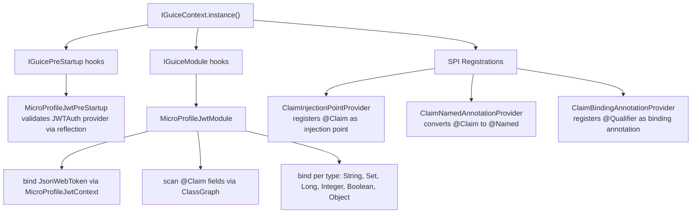
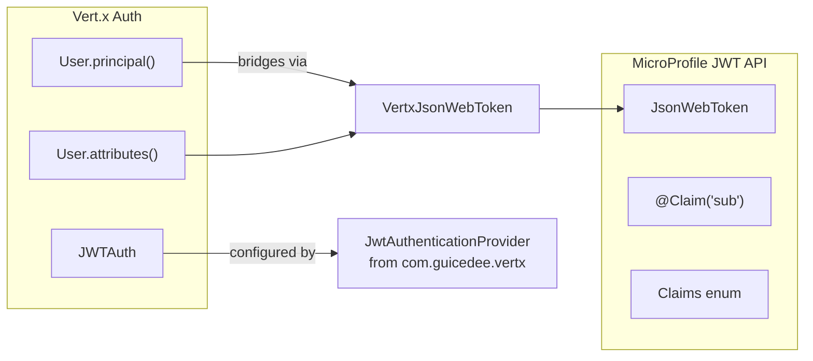
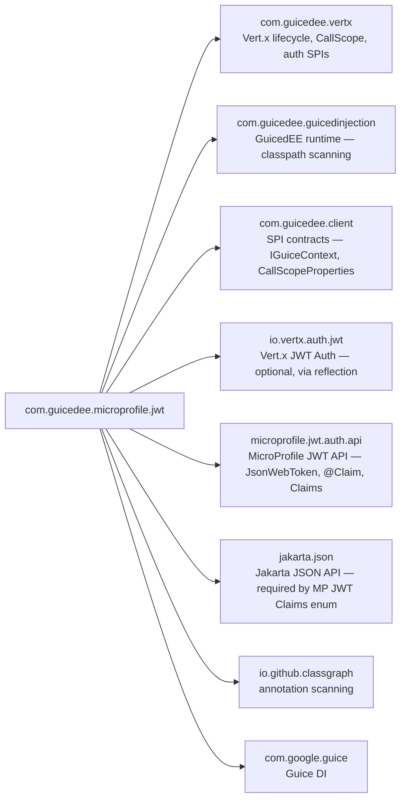

# GuicedEE MicroProfile JWT

[](https://github.com/GuicedEE/microprofile-jwt/actions/workflows/build.yml)
[](https://central.sonatype.com/artifact/com.guicedee.microprofile/jwt)
[](https://www.apache.org/licenses/LICENSE-2.0)


MicroProfile JWT Auth bridge for [GuicedEE](https://github.com/GuicedEE) — maps the MP JWT `JsonWebToken` interface and `@Claim` injection to the Vert.x JWT Auth provider used by GuicedEE.

Built on [MicroProfile JWT](https://github.com/eclipse/microprofile-jwt-auth) · [Vert.x Auth JWT](https://vertx.io/docs/vertx-auth-jwt/java/) · [Google Guice](https://github.com/google/guice) · JPMS module `com.guicedee.microprofile.jwt` · Java 25+

## 📦 Installation

```xml
<dependency>
  <groupId>com.guicedee.microprofile</groupId>
  <artifactId>jwt</artifactId>
</dependency>
```

<details>
<summary>Gradle (Kotlin DSL)</summary>

```kotlin
implementation("com.guicedee.microprofile:jwt:2.0.1")
```
</details>

## ✨ Features

- **`JsonWebToken` injection** — backed by Vert.x `User` principal, resolved per-request from the GuicedEE `CallScope`
- **`@Claim` injection without `@Inject`** — `@Claim("sub")` fields are auto-injected via `InjectionPointProvider` and `NamedAnnotationProvider` SPIs, mirroring the `@ConfigProperty` pattern
- **Type-safe claim bindings** — `String`, `Set<String>`, `Long`, `Integer`, `Boolean`, and `Optional<T>` wrappers supported per claim
- **Seamless bridge** — works with `@JwtAuthOptions` from the `com.guicedee.vertx` auth module
- **CallScope-aware context** — JWT context stored in GuicedEE `CallScopeProperties` for correct behavior across Mutiny/reactive thread switches; falls back to `ThreadLocal` outside call scopes
- **Optional auth dependency** — auth provider classes are accessed via reflection; the module works without the JWT auth provider on the module path
- **JPMS-ready** — named module with proper exports, provides, and opens directives

## 🚀 Quick Start

**Step 1** — Configure JWT auth on your `package-info.java` (see [Vert.x Auth docs](https://github.com/GuicedEE/Guiced-Vert.x)):

```java
@JwtAuthOptions(
    keystorePath = "keystore.jceks",
    keystoreType = "jceks",
    keystorePassword = "${JWT_KEYSTORE_PASSWORD}",
    algorithm = "RS256",
    authorizationType = JwtAuthorizationType.MICROPROFILE
)
package com.example.auth;
```

**Step 2** — Inject MP JWT types (no `@Inject` needed on `@Claim` fields):

```java
import jakarta.inject.Inject;
import org.eclipse.microprofile.jwt.Claim;
import org.eclipse.microprofile.jwt.JsonWebToken;

public class UserService {

    @Inject
    private JsonWebToken jwt;

    @Claim("sub")
    private String subject;

    @Claim("groups")
    private Set<String> groups;

    @Claim("exp")
    private long expiration;

    public String currentUser() {
        return subject;
    }
}
```

**Step 3** — Register via JPMS:

```java
module com.example {
    requires com.guicedee.microprofile.jwt;
    opens com.example to com.google.guice;
}
```

## 📐 Architecture



### Bridge Model



## 🔌 Supported Injection Types

`MicroProfileJwtModule` scans all classes with `@Claim`-annotated fields and creates Guice bindings for each:

| Field type | Binding | Example claim |
|---|---|---|
| `String` | Direct value from JWT claim | `sub`, `iss`, `jti` |
| `Set<String>` | JSON array → `Set<String>` | `groups`, `aud` |
| `long` / `Long` | Numeric claim | `exp`, `iat` |
| `int` / `Integer` | Numeric claim | custom claims |
| `boolean` / `Boolean` | Boolean claim | custom claims |
| `Optional<String>` | Wrapped optional | any claim |
| `Object` | Raw claim value (fallback) | any claim |

## ⚙️ Request Context

The JWT context is managed per-request via `MicroProfileJwtContext`:

```java
// In a route handler or filter:
MicroProfileJwtPreStartup.setCurrentUser(routingContext.user());
try {
    // handle request — @Claim fields resolve from this context
} finally {
    MicroProfileJwtContext.clear();
}
```

### Context storage strategy

| Environment | Storage | Thread-safe across switches |
|---|---|---|
| Inside `CallScope` (HTTP handlers) | `CallScopeProperties.properties` map | ✅ Yes |
| Outside `CallScope` (tests, CLI) | `ThreadLocal` fallback | ✅ Yes (same thread) |

## 🔧 SPI Extension Points

All SPIs are discovered via `ServiceLoader`. Register implementations with JPMS `provides...with` or `META-INF/services`.

| SPI | Implementation | Purpose |
|---|---|---|
| `IGuicePreStartup` | `MicroProfileJwtPreStartup` | Validates JWT auth provider availability at startup |
| `IGuiceModule` | `MicroProfileJwtModule` | Scans `@Claim` fields, binds `JsonWebToken` and claims to Guice |
| `InjectionPointProvider` | `ClaimInjectionPointProvider` | Registers `@Claim` as a Guice injection point (no `@Inject` needed) |
| `NamedAnnotationProvider` | `ClaimNamedAnnotationProvider` | Converts `@Claim("x")` → `@Named("x")` for binding keys |
| `BindingAnnotationProvider` | `ClaimBindingAnnotationProvider` | Registers `@jakarta.inject.Qualifier` as a binding annotation |

## 🗺️ Module Graph



## 🏗️ Key Classes

| Class | Package | Role |
|---|---|---|
| `VertxJsonWebToken` | `jwt` | `JsonWebToken` implementation backed by Vert.x `User` principal |
| `MicroProfileJwtContext` | `jwt` | CallScope-aware holder for the current request's `JsonWebToken` |
| `ClaimLiteral` | `jwt` | Runtime `@Claim` annotation implementation for Guice binding keys |
| `ClaimValueProvider` | `jwt` | Guice `Provider<T>` that resolves claims from the current JWT |
| `MicroProfileJwtModule` | `implementations` | `IGuiceModule` — scans `@Claim` fields and creates per-type bindings |
| `MicroProfileJwtPreStartup` | `implementations` | `IGuicePreStartup` — validates JWT auth provider via reflection |
| `ClaimInjectionPointProvider` | `implementations` | Registers `@Claim` as a Guice injection point |
| `ClaimNamedAnnotationProvider` | `implementations` | Converts `@Claim("x")` → `@Named("x")` |
| `ClaimBindingAnnotationProvider` | `implementations` | Registers `@Qualifier` as a binding annotation |

## 🧩 JPMS

Module name: **`com.guicedee.microprofile.jwt`**

The module:
- **exports** `com.guicedee.microprofile.jwt`, `com.guicedee.microprofile.jwt.implementations`
- **requires transitive** `com.guicedee.vertx`, `com.guicedee.guicedinjection`, `io.vertx.auth.jwt`, `microprofile.jwt.auth.api`, `jakarta.json`
- **provides** `IGuiceModule` with `MicroProfileJwtModule`
- **provides** `IGuicePreStartup` with `MicroProfileJwtPreStartup`
- **provides** `InjectionPointProvider` with `ClaimInjectionPointProvider`
- **provides** `NamedAnnotationProvider` with `ClaimNamedAnnotationProvider`
- **provides** `BindingAnnotationProvider` with `ClaimBindingAnnotationProvider`
- **opens** `com.guicedee.microprofile.jwt` and `com.guicedee.microprofile.jwt.implementations` to `com.google.guice`

## 🧪 Testing

```java
import com.guicedee.microprofile.jwt.MicroProfileJwtContext;
import com.guicedee.microprofile.jwt.VertxJsonWebToken;
import io.vertx.core.json.JsonObject;
import io.vertx.ext.auth.User;
import org.junit.jupiter.api.Test;
import static org.junit.jupiter.api.Assertions.*;

class JwtBridgeTest {

    @Test
    void claimsAreResolvedFromVertxUser() {
        User user = User.create(new JsonObject()
            .put("sub", "user-123")
            .put("iss", "https://auth.example.com")
            .put("groups", new io.vertx.core.json.JsonArray().add("admin")));

        VertxJsonWebToken jwt = new VertxJsonWebToken(user);

        assertEquals("user-123", jwt.getSubject());
        assertEquals("https://auth.example.com", jwt.getIssuer());
        assertTrue(jwt.getGroups().contains("admin"));
    }

    @Test
    void contextSetAndClear() {
        User user = User.create(new JsonObject().put("sub", "test"));
        MicroProfileJwtContext.setCurrent(new VertxJsonWebToken(user));

        assertNotNull(MicroProfileJwtContext.getCurrent());
        assertEquals("test", MicroProfileJwtContext.getCurrent().getSubject());

        MicroProfileJwtContext.clear();
        assertNull(MicroProfileJwtContext.getCurrent());
    }
}
```

## 🤝 Contributing

Issues and pull requests are welcome — please add tests for new claim types, bridge behaviors, or context strategies.

## 📄 License

[Apache 2.0](https://www.apache.org/licenses/LICENSE-2.0)
